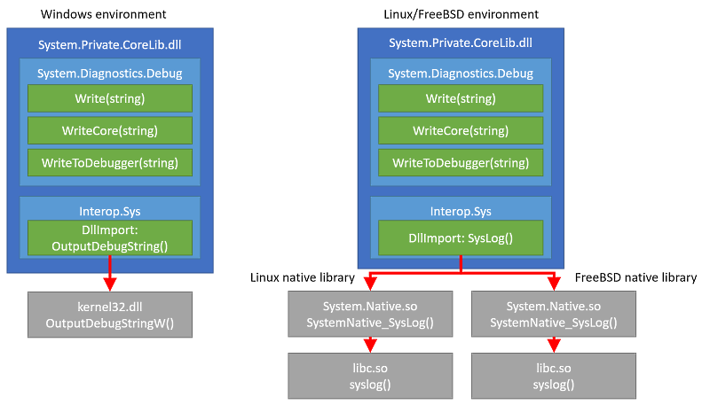

# de:code 2019 CM12 - Interoperability of .NET assemblies.


## はじめに

このリポジトリは、2019年5月29,30日に東京で開催される[「de:code 2019」](https://www.microsoft.com/ja-jp/events/decode/2019/default.aspx)のセッション[「CM12: .NET Core マルチプラットフォームの本質」](https://www.microsoft.com/ja-jp/events/decode/2019session/detail.aspx?sid=CM12)に対応するサンプルコードと解説を公開しています。

* 本記事はKouji Matsuiが独自に構成、執筆したものであり、[「Microsoft MVPパーソナルスポンサー」](https://www.microsoft.com/ja-jp/events/decode/2019/sponsor.aspx)として提供するものです。de:code 2019のオフィシャルドキュメントではありません。
* 本記事執筆時には、セッションの概要のみ公開されているため、内容が密接に連携しない場合があります。また、内容は、原稿執筆時の情報によります。
* サンプルコードの開発検証環境は、Visual Studio 2017 (15.9.11)です。2019でも動作すると思われますが、都合により未確認です。また、Linux環境はWSL1のUbuntu 18.04 + dotnet-sdk-2.2 (2.2.204-1)で検証しました。
* 読者の想定難易度は、セッションの基準であるLevel 400より多少低いところを出発点とし、章を追うことでセッションの基準難易度に近づくようにしています。できるだけ抽象的な解説を避け、具体例や図による解説、既存のコードへの参照を含めています。

## 著作権表記

* Copyright (c) 2019 Kouji Matsui All rights reserved.
  本コンテンツの著作権、および本コンテンツ中に出てくる商標権、団体名、ロゴ、製品、サービスなどはそれぞれ、各権利保有者に帰属します。
* ライセンスは外部参照を除き、MITとします。コードにはいかなる保証もありません。ご自身のプロジェクトに適用する場合は、各自の判断で行ってください。
* この資料はコミュニティコンテンツです。ライセンスに従っていただけるのであれば、[GitHub上でissueとpull requestを受け付けます](https://github.com/kekyo/decode2019_CM12)。

## サンプルコード

* このリポジトリ内に配置され、ドキュメント内からリンクされているので参照してください。
* Azure PipelinesでCIしています: [](https://dev.azure.com/kekyo/decode2019_CM12/_build?definitionId=8)

# 概要

.NETにおけるマルチプラットフォーム対応を支えるための、アセンブリレベルでの互換性の対処方法について、サンプルコードと解説を行います。章が進むにつれて、より細部についての解説を行っています。

* マネージドサイド
  * インターフェイス分離
  * Bait and switchテクニック
* アンマネージ連携
  * P/Invoke
  * ガベージコレクションの影響
* ランタイムサイド
  * System.Private.CoreLib
  * ランタイム機能呼び出しの手段

# マネージドサイド

マルチプラットフォーム戦略で最も一般的に使用されるテクニックは、インターフェイス分離と依存注入(Dependency Injection)でしょう。この章では、インターフェイス分離と、それに似たもう一つのテクニックについて解説します。

## インターフェイス分離

インターフェイス分離は、最も一般的で基本的なOOPのテクニックです。.NETのインターフェイス型を使用して、異なる実装の詳細を、同一のインターフェイスで分離する事により、マルチプラットフォームに対応した処理として共通に扱えるようにします。

[Part1_SplitByInterfaceプロジェクト](Part1_SplitByInterface)は、以下の機能を持ちます:

* 複数の値を入力すると、計算結果が出力される。
* 入出力の対象は、コンソール(コマンドライン)と、GUI(WPF)である。

計算を司る共通のライブラリ「Calculator.Core.dll」と、それらを使用する各アプリケーションをインターフェイス定義で分離します。

コンソールアプリケーションの場合:


GUIアプリケーションの場合:


この図のように、右側の計算ライブラリには、プラットフォーム固有の実装は全く含まれず、左側のアプリケーション側に固有の実装を用意しておき、インターフェイス定義経由で計算ライブラリから操作できるようにします。

ConsoleCalculatorの実行結果:


WpfCalculatorの実行結果:


ここでは、手動での依存注入(メソッド引数で直接注入する)を行っています(より発展した例として、MEFや各種依存注入ライブラリを併用することが考えられますが、割愛します)。このサンプルコードで重要な点を以下に挙げます:

* 計算を実行する本体(Calculator.Core)ライブラリは、プラットフォーム中立であり、netstandard2.0としてビルドしている。
* Calculatorライブラリには、コンソールやGUIへの入出力コードは一切含まれておらず、それぞれ独立したアセンブリ(ConsoleCalculator, WpfCalculator)にのみ含まれる。
* 同じ手法を用いて、その他のプラットフォームにも移植できる。その際、計算ライブラリに手を入れる必要がない。

## Bait and switchテクニック

このテクニックは、以下のような二種類のアセンブリを用意しておき、コードのビルド時と実行時で異なるアセンブリを使用するものです:

* ビルド用アセンブリ:
  ユーザーのアプリケーションやライブラリのビルドに使用するためだけのアセンブリ(「参照アセンブリ」と呼ぶ)。アセンブリ内の実装コードは、まったく存在しないか部分的にしか存在しない。コンパイラが、型のメタデータ定義(クラス名やメソッド名、型や引数群など)さえ確認できれば良い。
* 実行時用アセンブリ:
  実行時に使用するアセンブリ。それぞれのプラットフォームに応じたアセンブリ(但し、アセンブリの厳密名とインターフェイス定義は上記と同一)を用意する。当然、アセンブリ内部の実装はそれぞれのプラットフォームによって異なる。

これは.NET標準に含まれるライブラリでも活用されています。例えば、「System.Runtime.dll」について考えます。ビルド時に参照するアセンブリ(SDKに含まれる)は、実は内部に実装が存在しません。しかし、型のメタデータ定義は存在するため、ビルド自体は成功します。その結果、アプリケーション内部には、System.Runtime.dllを使用している、という参照情報だけが残ります。

次に、アプリケーションを実行環境に移して実行すると、実行環境に存在する「別の」System.Runtime.dllが使用されます(Windowsの場合、GACに配置されているか、.NET Coreのランタイムディレクトリに配置されています)。このアセンブリにはプラットフォーム環境に依存した実装が入っていますが、型のメタデータ定義は同一であり、アセンブリローダーは問題なくロード出来るため、アプリケーションが実行できます。


もちろん、参照アセンブリとメタデータが異なっていた場合(例えば、あるクラスのメソッドの引数の型が違っているなど)は、実行時に[MissingMethodException](https://docs.microsoft.com/ja-jp/dotnet/api/system.missingmethodexception)などの例外が発生する可能性があります。そのため、参照アセンブリと実行時アセンブリのメタデータが同一となるように、注意深く実装しなければなりません。

[Part2_BaitAndSwitchプロジェクト](Part2_BaitAndSwitch)は、最初の計算アプリケーションをBait and switchテクニックを使って実装したものです:

* 参照アセンブリとして、[Host.Referenceプロジェクト](Part2_BaitAndSwitch/Host.Reference/Interaction.cs)を用意する。実装は空で、クラスとメソッドが定義されているだけである。
* 上記参照アセンブリの定義と同一だが、それぞれコンソールとWPFに対応する実装を含んだ、[Host.Consoleプロジェクト](Part2_BaitAndSwitch/Host.Console/Interaction.cs)と[Host.Wpfプロジェクト](Part2_BaitAndSwitch/Host.Wpf/Interaction.cs)を用意する(アセンブリのファイル名はすべて同一で、Host.Core.dll)。
* 他のアセンブリはすべて共通で、アプリケーション実行前にHost.RefereceをHost.ConsoleまたはHost.Wpfに入れ替える。
  * Console.batから起動すると、Host.Consoleに置き換えて実行する。
  * Wpf.batから起動すると、Host.Wpfに置き換えて実行する。
  * 置き換えずに実行すると、Host.Referenceを使うことになるため、実行時例外が発生する。

Bait and switchテクニックは、実装を入れ替えることができると言う点で、インターフェイス分離とよく似ています。しかし、インターフェイス分離の場合は、設計者が最初から適切に分離設計をする必要があります。Bait and switchは、CLRがアセンブリを同一視する方法に乗じて、コードに全く手を入れずに、プラットフォーム依存処理を入れ替えることを可能にします。

以下にこの2つの分離手法を比較した表を示します:

|手法|メリット|デメリット|
|:---|:---|:---|
|インターフェイス分離|OOPの一般的な手法。誰でもリスクなしで使用でき、コンパイラが型チェックでエラーを検出してくれる|初めから使用する前提で設計する必要がある|
|Bait and switch|後から依存性の分離を行うことができる|型チェックはコンパイル時に行われないため、問題があると実行時エラーを起こす|

かつてのPortable Class Libraryは、Bait and switch手法で互換性を実現しました。ここまでの解説で、PCLが何十というプロファイルを持っていたことを考えると、互換性を維持することがいかに困難であったかが想像出来ます。

Bait and switchを適用する場合は、メタデータの不一致を何らかの方法で開発時に検証できるようにするか、あるいはテンプレートコードの自動生成や合成ができるようにするなどの手法を用意し、開発の困難さを軽減することが重要です。

# アンマネージ連携

P/Invokeは、.NETのアンマネージドコード連携の手段の一つです。もう一つはCOM連携ですが、本稿では割愛します。

## P/Invoke

P/InvokeはCLRに組み込まれている、ネイティブコードライブラリとの連携機能です。また、C#などのコンパイラは、P/Invokeを簡便なシンタックスで利用可能にしています。例えば、以下のコードは、C#から直にWin32 APIを呼び出します:

```csharp
public static class Program
{
    // Win32デバッグメッセージ出力API
    [DllImport("kernel32.dll", CharSet=CharSet.Unicode)]
    private static extern void OutputDebugString(string lpOutputString);

    public static void Main(string[] args) =>
        OutputDebugString("Hello P/Invoke!");
}
```

ネイティブコードのライブラリがダイナミックリンクライブラリとして用意されていれば、全く同じ手法でコードを記述することが出来ます。LinuxやMacOSといったプラットフォーム向けのコードは、それぞれで利用可能なネイティブコードライブラリが異なることが多々ありますが、P/Invoke自体の使用方法は同じです。.NET Coreやmono向けのライブラリも、同じように作ることができます。特に、ネイティブコードライブラリがクロスプラットフォームで（dll、dylib、soなど、ライブラリの形式が異なっても）同じAPIを提供していれば、同一のP/Invokeコードがそれぞれのプラットフォームで実行できます。

前章で述べた、インターフェイス分離設計やBait and switchテクニックをP/Invokeと組み合わせると、.NETでマルチプラットフォームの一貫したライブラリ設計を行うことができます。つまり、前章の依存コードの部分をP/Invokeを使って実装すれば、そのプラットフォーム固有のAPIがネイティブコードであったとしても、部品として使える共通のアセンブリを構築できる、と言うことです。

[Part3_PInvokeプロジェクト](Part3_PInvoke)は、これまでの説明を踏まえた、マルチプラットフォームアプリケーションです:

* コマンドライン引数に指定した文字列が、デバッグメッセージとしてシステムに送信される。
* デバッグメッセージは以下のように処理される:
  * Bait and switchテクニックを使用する。Windows用とLinux用で、実装は異なるが共通のメタデータを持つアセンブリを用意する。
  * Windows環境の場合、Win32のOutputDebugString APIを使用して出力する。これは[SysinternalsのDebugViewユーティリティ](https://docs.microsoft.com/en-us/sysinternals/downloads/debugview)で確認できるほか、各種デバッガがアタッチされていれば、デバッガ上で確認できる。
  * Linux環境の場合、syslog APIを使用して出力する。

注意: 一般的な開発でこの程度の規模であれば、Bait and switchテクニックを使用する理由は全くありません。ここでは、後述のランタイムサイドの解説に関係するため、あえてBait and switchで実装を行っています。

DebugMessageプロジェクトは、DebugMessage.Referenceの参照アセンブリを使ってビルドします。実際に必要なのは、実行用のアセンブリ、DebugMessage.Win32とDebugMessage.Linuxです。前章のサンプルと同じく、これらを実行時に置き換える必要があります。

以下はWindows環境でWin32.batを実行したときの、DebugViewユーティリティの出力です:


以下はWSL1のUbunt 18.04環境でlinux.shを実行したときの、`/var/log/syslog`の出力です (syslogを使うため、あらかじめ`service rsyslog start`でrsyslogを動かしておく必要があります):


## ガベージコレクションの影響

P/Invokeを初めて使う場合、ネイティブコード実行中の.NETインスタンスがどのように扱われるのか、疑問に思う方も居ると思います。例えば、.NETで生成したインスタンスをP/Invokeを通じてネイティブコードに渡した場合、ガベージコレクタが意図せず回収する可能性は無いのか、という点です。

例えば、以下の疑似コード:

```csharp
// foo.dll内のReadToBuffer APIを呼び出す
// extern "C" void ReadToBuffer(uint8_t* pBuffer, int32_t size);
[DllImport("foo.dll")]
private static extern void ReadToBuffer(byte[] buffer, int size);

public void Read()
{
    var buffer = new byte[100];

    // byte配列は自動的にマーシャリングされる。
    // API呼び出し中にbufferがGCによって回収されることは無いのか？
    ReadToBuffer(buffer, buffer.Length);

    // (A)
    var data0 = buffer[0];
}
```

ガベージコレクタは、引数・ローカル変数・フィールドなどからインスタンスが参照されているかどうかを追跡しています。この場合、bufferのインスタンスが回収されてしまうことはありません。一般的に、APIが実行を終えて戻ってきたとき(A)、当然bufferにアクセス出来ることが期待できます。

(一般的には、マーシャリングという用語は、データ形式の相互変換とスレッドなどのコンテキスト切り替えの両方の意味で使いますが、本稿では前者のデータ形式の相互変換にのみ使用します。)

ガベージコレクタがインスタンスを回収するかどうかの他にも、ネイティブコードとして考慮すべき点があります。それは、インスタンスの物理的なアドレス(ポインタ値、但し仮想メモリ上の)が変わるのか同じ位置にあるのか、ということです。ガベージコレクタの手法にもよりますが、.NET CLRの場合は、ヒープコンパクションと呼ばれる機能により、必要に応じてインスタンスが移動する事があります。これらをまとめると、以下のようになります:

||維持される|回収されるかも知れない|
|:--|:--|:--|
|移動しない|Pinned|---|
|移動するかもしれない|Normal|Weak|

ネイティブコードライブラリを設計する場合は、CLRの伺い知れないところで動作するため、通常、インスタンスが維持され、かつインスタンスが移動しないこと(Pinned)が要求されます。稀にインスタンスが存在し続けて欲しいが、インスタンス自体にはアクセスしない(Normal)、という場合もあります(Weakについては本資料では割愛します)。

先程説明したように、インスタンスが追跡可能な状態であれば、何もしなくてもNormalと同様に維持されます。インスタンスがどこからも追跡できなくなるような状況下では、明示的にNormalまたはPinnedとしてCLRに通知する必要があります。

[GCHandle構造体](https://docs.microsoft.com/ja-jp/dotnet/api/system.runtime.interopservices.gchandle)を使用すると、追跡可能かどうかにかかわらず、PinnedやNormalの状態を作り出すことができます。Pinnedとした場合は、インスタンスへの生のポインタを取得できます。例えば:

```csharp
// foo.dll内のReadToBuffer APIを呼び出す
// extern "C" void ReadToBuffer(uint8_t* pBuffer, int32_t size);
[DllImport("foo.dll")]
private static extern void ReadToBuffer(IntPtr buffer, int size);

public void Read()
{
    var buffer = new byte[100];

    // GCHandleを使って生のポインタを得る(手動マーシャリング)
    // 生のポインタを得るには、アドレスが固定されなければならない(Pinned)
    var bufferHandle = GCHandle.Alloc(buffer, GCHandleType.Pinned);

    try
    {
        // pBufferは配列の先頭を示す、本物のアドレス
        // (この他にToIntPtrメソッドがあるが、これはGCHandleの抽象表現であり、ポインタとしては使えない)
        var pBuffer = bufferHandle.AddrOfPinnedObject();
        ReadToBuffer(pBuffer, buffer.Length);
    }
    finally
    {
        // 不要になったら解放する必要がある。解放しなかった場合はメモリリークする。
        bufferHandle.Free();
    }
}
```

このコードは、先程の例とほぼ同じです。P/Invoke呼び出しのためのポインタへのマーシャリングを自動で行うか、手動で行うかの違いです。以下に特徴を示します:

|手法|メリット|デメリット|
|:---|:---|:---|
|自動マーシャリング|安全で簡潔に記述できる|マーシャリングのタイミングをコントロールできないため、パフォーマンスの問題につながることがある|
|手動マーシャリング|マーシャリングのタイミングをコントロールできるため、パフォーマンスを最大化出来る|ガベージコレクタに誤って解放されたり、メモリリークしないように注意を払う必要がある|

例えば、ネイティブライブラリの関数によっては、引数として渡されたポインタを保持して、ずっと後になってから参照して使うこともあります。そのような場合には、最初に明示的にNormalとし、明らかにネイティブコードで使用されなくなるまで保持し、最終的に解放する必要があります。

また、バッファへのポインタが頻繁に必要になる場合は、自動マーシャリングするよりも、一度だけ手動マーシャリングしてPinnedとし、連続してポインタを使用し、最後に手動で解放したほうが効率的かもしれません。

[Part4_Marshalingプロジェクト](Part4_Marshaling)は、手動マーシャリング処理の例です:

* Win32NativeLibraryプロジェクトは、Visual C++のネイティブプロジェクトで、GenerateData APIを公開します。GenerateData APIは指定されたバッファアドレスに、数列を書き込みます。
* BothMarshalingTypesプロジェクトから、P/InvokeでGenerateData APIを呼び出します。
* この呼び出しの、自動マーシャリングと手動マーシャリングの例を示します。
* 両者の処理時間差を、簡易的に計測します。具体的な結果は、環境に依存するためここでは示しませんが、自動マーシャリング > 手動マーシャリング、となっている事を確かめることが出来ると思います。
  * 両者の差はかなり小さいはずです。なぜなら、配列のマーシャリングコストはそれほど高くないからです。

この例では、非常に単純なデータ構造(配列)ですが、実際のマーシャリングシナリオはもっと複雑です。場合によっては、手動マーシャリングを行わないと、現実的なパフォーマンスを引き出せない可能性があります。マーシャリングの詳細については、[「プラットフォーム呼び出しによるデータのマーシャリング」](https://docs.microsoft.com/ja-jp/dotnet/framework/interop/marshaling-data-with-platform-invoke)を参照してください。

以下に、P/Invokeを使用する際に、暗黙または意図して注意する必要のある事項をまとめます:

* マーシャリングを自動で行うのか、手動で行うのか、及びパフォーマンスへの影響。
* ガベージコレクタによって意図せずインスタンスが移動・解放されないようにする、あるいは正しく解放されるようにする。

# ランタイムサイド

ここまでは、一般の開発者がマルチプラットフォーム対応アプリケーションを設計する場合において考慮すべき点を、如何に依存コードを分離して実現するか、という視点で解説しました。

この節では、.NET自身が、マルチプラットフォーム対応するためにどのような手段を使用しているのかを述べます。つまり、.NET Coreにおいて、coreclrやcorefxがどのようにマルチプラットフォームを実現しているのかという点に注目します。

基本的に、今まで述べてきたテクニックが利用できる部分では、そのまま利用できます。例えば、System.IO.FileStreamクラスは、ファイルへのアクセスにWindowsとLinuxで異なるAPIを使用するはずです。しかし、インターフェイスで分離されているわけではないため、Bait and switchを利用して切り分け、P/InvokeでそれぞれのAPIを呼び出している、と想像出来ます。

## System.Private.CoreLib

かつて、.NET Frameworkでは、[BCL (Base class library)](https://docs.microsoft.com/ja-jp/dotnet/standard/framework-libraries#base-class-libraries)を、「mscorlib.dll」という単一のアセンブリで担っていました。

.NET Core 1.0のリリースにあたり、.NET Frameworkの歴史で巨大化してしまったmscorlib.dllを分割するために、前節で例示した「System.Runtime.dll」と「System.Private.CoreLib.dll」、その他の細かいアセンブリ群に細分化しました。特に、.NET CoreCLRランタイムと密接に絡む実装が含まれるアセンブリが、System.Private.CoreLibアセンブリです。


この図は、Part1_SplitByInterfaceプロジェクトのCalculator.Core.dllをILSpyで確認したものです。左上がCalculator.Coreアセンブリで、netstandardアセンブリに依存しています。netstandardアセンブリはかなり多くのアセンブリに依存していますが、その中にSystem.Runtimeアセンブリが存在します。

System.RuntimeアセンブリはSystem.Private.CoreLibアセンブリに依存し、ここから先に依存する.NETのアセンブリはありません。そして、System名前空間を確認すると、見慣れた`Array`,`Boolean`,`Byte`,`Char`といった型が定義されていることがわかります。

* 余談: monoは、.NET Framework 1.0が出てから数年でプロジェクトが始まっていますが、アセンブリ参照の厳密名さえ同じであれば、実体が別のアセンブリをロードして実行できるという性質を利用して、mscorlib.dllという同じ名前を使いつつ中身はmono独自に実装されている、別のアセンブリをロードすることで、.NET Frameworkとの互換性を実現していました。マルチプラットフォーム動作の実現については、後述するQCallやFCallに類似する仕組みを用いて、同一の実装アセンブリで実現していました。ただし、monoの実装は、corefxのコード取り込み作業が継続的に進んでいることもあって、流動的です。

System.Private.CoreLibアセンブリ内には、かなり多くのクラスや構造体が定義されています。これらの型のメソッドは、そのプラットフォームに依存した処理が実装されているはずです。例として、`System.Diagnostics.Debug`クラスを追ってみましょう:

### Debug.Write(string)

```csharp
internal static Action<string> s_WriteCore = WriteCore;

public static void Write(string message)
{
    lock (s_lock)
    {
        if (message == null)
        {
            // 空文字を出力
            s_WriteCore(string.Empty);
        }
        else
        {
            if (s_needIndent)
            {
                message = GetIndentString() + message;
                s_needIndent = false;
            }
            // 引数の文字列を出力
            s_WriteCore(message);
            if (message.EndsWith(Environment.NewLine))
            {
                s_needIndent = true;
            }
        }
    }
}
```

付加機能のためのコードが前後にありますが、結局`s_WriteCore(message)`でメッセージを出力しているようです。このフィールドはActionデリゲートで、初期化時には`WriteCore(string)`メソッドを指しています。

### Debug.WriteCore(string)

```csharp
private static void WriteCore(string message)
{
    lock (s_ForLock)
    {
        if (message == null || message.Length <= 4091)
        {
            WriteToDebugger(message);
        }
        else
        {
            int i;
            for (i = 0; i < message.Length - 4091; i += 4091)
            {
                WriteToDebugger(message.Substring(i, 4091));
            }
            WriteToDebugger(message.Substring(i));
        }
    }
}
```

引数のmessageを4091文字づつ分割して、`WriteToDebugger()`メソッドで出力しています (4091文字づつである理由については定かではありませんが、PAGE_SIZE * 2に収まる範囲、とかそういう事かもしれません)。

### Debug.WriteToDebugger(string)

```csharp
private static void WriteToDebugger(string message)
{
    if (Debugger.IsLogging())
    {
        Debugger.Log(0, null, message);
    }
    else
    {
        Interop.Kernel32.OutputDebugString(message ?? string.Empty);
    }
}
```

見慣れた`OutputDebugString`というシンボルが出てきました。

### Interop.Kernel32.OutputDebugString(string)

```csharp
// Win32 API OutputDebugString
[DllImport("kernel32.dll", CharSet = CharSet.Unicode, EntryPoint = "OutputDebugStringW", ExactSpelling = true)]
internal static extern void OutputDebugString(string message);
```

これで、Windows環境のSystem.Private.CoreLibアセンブリには、Win32 APIを直接呼び出す実装が含まれていることが確認できました。Linux版.NET Core SDK 2.2のSystem.Private.CoreLibアセンブリをILSpyで見ると、以下のようになっていました:

(/usr/share/dotnet/shared/Microsoft.NETCore.App/2.2.5/ 配下にあります。バージョンは各自の環境に合わせて読み替えて下さい)

```csharp
private static void WriteToDebugger(string message)
{
    if (Debugger.IsLogging())
    {
        Debugger.Log(0, null, message);
    }
    else
    {
        Interop.Sys.SysLog((Interop.Sys.SysLogPriority)15, "%s", message);
    }
}
```

```csharp
[DllImport("System.Native", EntryPoint = "SystemNative_SysLog")]
internal static extern void SysLog(SysLogPriority priority, string message, string arg1);
```

Windowsの方はWin32 APIを直接呼び出すようになっていましたが、Linuxの方は`System.Native`と付けられたネイティブライブラリの`SystemNative_SysLog`メソッドを呼び出しているようです。確認してみると、確かに存在します:


このネイティブライブラリを、「PAL (Platform abstraction layer)」と呼んでいます。歴史的に、Windowsへの実装が第一であったことからか、Win32 APIのインターフェイスを模すように作られて、今に至るようです。

### corefxの実装

以上を踏まえて、ソースコードがどうなっているかを確認してみます。[System.Diagnostics.Debugクラスのコードはここにあります](https://github.com/dotnet/corefx/tree/master/src/Common/src/CoreLib/System/Diagnostics)。partial classで分割されていて、WriteToDebuggerメソッドの実装は、[`DebugProvider.Windows.cs`](https://github.com/dotnet/corefx/blob/b3ac650a36e2fa04988fb37c4a0a3195a9e2dc36/src/Common/src/CoreLib/System/Diagnostics/DebugProvider.Windows.cs#L77)と、[`DebugProvider.Unix.cs`](https://github.com/dotnet/corefx/blob/b3ac650a36e2fa04988fb37c4a0a3195a9e2dc36/src/Common/src/CoreLib/System/Diagnostics/DebugProvider.Unix.cs#L63)の2つのファイルに分割されています。おそらくビルド時に、Windows版とLinux版で使い分けるのでしょう。内容はILSpyで見たものと全く同じです。

ところで、.NET CoreはLinuxだけではなく、FreeBSDもサポートしています。しかし、DebugProvider.Unix.csは名前の通り、Unix環境で共通に使われるようです。ここではこれ以上掘り下げませんが、LinuxとFreeBSDで実装に違いがあるとすれば、以下の図のようにネイティブライブラリのPALの方で吸収しているのではないかと思います。



* 余談: PALの呼び出しは、`#if FEATURE_PAL`と言うプリプロセッサ指令で切り分けられていることがあります。興味深いことにこのシンボル名は、.NET Frameworkのソースコードを参照できる「referencesource.microsoft.com」でも、ところどころで見ることが出来ます。つまり、.NET Core世代ではなく、.NET Frameworkの頃から、PALによるネイティブ実装の切り替えを想定(あるいは使用)していた可能性があります。残念ながら、サイトで見ることができるソースコードはマネージド側だけなので、PALが何に移植されていたのかはわかりません。

## ランタイム機能呼び出しの手段

前節では、プラットフォームごとの実装を切り分けるのに、System.Private.CoreLibアセンブリを基準として、Bait and switchで実行アセンブリが差し替わっていることを確認しました。例としてDebugクラスの実装を追いましたが、そこでは普通にP/Invoke機能を使ってネイティブライブラリを呼び出していました:

```csharp
// Windows環境において、Win32 APIを呼び出すP/Invokeの定義
[DllImport("kernel32.dll", CharSet = CharSet.Unicode, EntryPoint = "OutputDebugStringW", ExactSpelling = true)]
internal static extern void OutputDebugString(string message);

// Linux(Unix)環境において、PALの実装を呼び出すP/Invokeの定義
[DllImport("System.Native", EntryPoint = "SystemNative_SysLog")]
internal static extern void SysLog(SysLogPriority priority, string message, string arg1);
```

しかし、.NET CLRの内部機能を呼び出す場合は、P/Invokeではなく、別の方法を使用する必要があります。以下に、3種類の呼び出し方法`QCall`, `FCall`, `HCall`について示します。それぞれの手法は異なり、目的によって使い分けられています。同じ機能を別の呼び出し方法で呼び出すことは出来ません。

### QCall

QCallは、P/Invokeにかなり似ています。P/Invokeで想定できるマーシャリングは、プリミティブ型であればそのまま使えます。文字列も、自動的にLPCWSTR (const wchar_t*)でマーシャリングされます。P/Invokeの場合、文字列の返却にStringBuilderを使いますが、代わりの低コストな手段が用意されています。それに加えてP/Invokeでは実現しない、ネイティブからの例外のスローが可能です。

内部でQCall呼び出しをラップする、C#のメソッドの実装例を示します:

```csharp
// QCallでネイティブコードを呼び出すための宣言
// (P/Invokeと似ているが異なる。基本的にpublicにはできない)
[DllImport("QCall", CharSet = CharSet.Unicode)]
private static extern bool Foo(
    int arg1, string arg2,
    System.Runtime.CompilerServices.StringHandleOnStack returnValue);

// ラップして安全なメソッドとして公開
public static string Foo(int arg1, string arg2)
{
    // 文字列を結果として受け取る場所を、スタックに用意する
    string returnValue = null;

    // ネイティブメソッドの呼び出し
    // スタック上のreturnValueを指すように、StringHandleOnStackが初期化される
    if (!Foo(arg1, arg2,
        System.Runtime.CompilerServices.JitHelpers.GetStringHandle(ref returnValue)))
    {
        throw new InvalidOperationException("...");
    }
    return returnValue;
}
```

第一に、QCallはP/Invokeと同じようにDllImport属性を使います。ライブラリ名は固定的に"QCall"を指定しておきます。ネイティブ側の実装は、マネージド側に値を返したい場合(この例のように、戻り値として文字列を返す想定)は、スタック上の文字列参照を追跡できるようにする`StringHandleOnStack`という型を使います。同様に、任意の参照型(objref)には、`ObjectHandleOnStack`を使います。これらを使うことで、P/Invokeで必要であったマーシャリングのコストを削減できます。

しかし、そもそもStringHandleOnStackや、そのインスタンスを取得する`JitHelpers`は、publicではありません([ソースコードはこちら](https://github.com/dotnet/coreclr/blob/master/src/System.Private.CoreLib/src/System/Runtime/CompilerServices/jithelpers.cs))。

つまり、QCallを処理するメソッドは、ほぼ公開メソッドにはなり得ず、System.Private.CoreLibアセンブリ内に閉じている必要があります。したがって上記の例のように、QCallメソッドはprivateとし、publicなファサードメソッドを定義する必要があります。そして、当然ですが、QCallの対象となるネイティブメソッドの実装は、.NET CLR内部に用意しておく必要があります。

仮に実装した場合、以下のような体裁を持ちます:

```cpp
// C++で記述する
BOOL QCALLTYPE FooNative::Foo(
    int arg1, LPCWSTR arg2,
    QCall::StringHandleOnStack returnValue)
{
    // QCall呼び出しを処理可能にするためのマクロ
    QCALL_CONTRACT;

    // QCall処理中に発生する例外が正しく伝搬するようにするマクロ
    BEGIN_QCALL;

    if (arg1 < 0)
    {
        // 例外をスローする
        COMPlusThrow(kArgumentException, L"arg1");
    }

    // 文字列もC/C++で想定するように、普通に使える
    // (つまり、文字列を示すポインタがGCによっていきなり移動したりしない。Pinned相当)
    printf("%d, %S", arg1, arg2);

    // 文字列への参照を、直接呼び出し元のスタックに設定できる
    // (P/InvokeにおけるStringBuilderほどのオーバーヘッドはないが柔軟性には欠ける)
    returnValue.Set(L"Hello");

    // QCallの後始末マクロ
    END_QCALL;

    // (BEGIN_QCALLからEND_QCALLまでの間で、returnすることは出来ない)
    return TRUE;
}
```

このメソッドを呼び出せるようにする(マネージド側のQCall宣言との結び付け)には、[ecalllist.hヘッダファイル](https://github.com/dotnet/coreclr/blob/master/src/vm/ecalllist.h)に対応を記述する必要があります(次に解説するFCallの宣言も、ここに記述します)。

ところで、QCallで実装したネイティブコードを実行中は、ガベージコレクションが起きる可能性が常に存在します。つまり、P/Invokeのときと同様に、ヒープに確保されたインスタンスに生ポインタでアクセスする場合は、ガベージコレクションによって移動したり回収されたりしないように、実装者が管理する必要があります。

### FCall

QCallの概要を見ると、その他の呼び出し手段は必要ないように見えます。FCallがQCallと決定的に異なるのは、FCallの呼び出しを実行している間、自動的にガベージコレクタが停止することです。

P/Invokeの場合、ガベージコレクションによる破壊を回避するには、GCHandleを使ってインスタンスをPinned状態にするかNormal状態に強制することでした。QCallの場合は、QCallのためのヘルパー型を使うことで、安全に処理することができますが、そこには少なからずコストを伴います。

FCall呼び出しを使用すると、その間ガベージコレクタが動かないため、いつでも生ポインタをPinnedされているものとして扱えるようになります。当然ですが、FCallで呼び出されたメソッドの処理時間が長引くと、.NETプロセス全体に悪影響を及ぼします。

以下は、System.Stringクラスの[インデクサのgetter実装](https://github.com/dotnet/coreclr/blob/580152a50e4092d32c7d05ec876cd6976483ebf1/src/System.Private.CoreLib/src/System/String.CoreCLR.cs#L39)です:

```csharp
[IndexerName("Chars")]
public char this[int index]
{
    // System.Stringのインデクサ: get_Chars()
    // DllImportではなく、以下の属性を使う
    [MethodImpl(MethodImplOptions.InternalCall)]
    get;
}
```

ILSpyを定常的に使っている方は、メソッド呼び出しをたどっていくと、この属性に行き当たるのを見たかも知れません。あなたが目にしたのは、.NET CLR内部のFCallメソッドへの扉、と言うわけです。

ecalllist.hには、[インデクサに対応するネイティブメソッドの対応付け](https://github.com/dotnet/coreclr/blob/580152a50e4092d32c7d05ec876cd6976483ebf1/src/vm/ecalllist.h#L111)が定義されています:

```cpp
// ecalllist.h: get_Chars()とGetCharAt()を結びつける宣言
FCFuncStart(gStringFuncs)
    FCIntrinsic("get_Chars", COMString::GetCharAt, CORINFO_INTRINSIC_StringGetChar)
FCFuncEnd()
```

そして、[対応するネイティブ実装](https://github.com/dotnet/coreclr/blob/580152a50e4092d32c7d05ec876cd6976483ebf1/src/classlibnative/bcltype/stringnative.cpp#L63)です:

```cpp
// C++で記述する
FCIMPL2(FC_CHAR_RET, COMString::GetCharAt,
    StringObject* str, INT32 index)    // (strは生ポインタであることに注意)
{
    // FCall呼び出しを処理可能にするためのマクロ
    FCALL_CONTRACT;

    // GCを長時間止めておく想定はなく、処理中にGCポーリングを必要としない
    FC_GC_POLL_NOT_NEEDED();

    VALIDATEOBJECT(str);
    if (str == NULL) {
        // 例外をスローする
        FCThrow(kNullReferenceException);
    }
    _ASSERTE(str->GetMethodTable() == g_pStringClass);

    // indexが文字数範囲内なら、バッファポインタから1文字を返す
    if (index >=0 && index < (INT32)str->GetStringLength()) {
        return str->GetBuffer()[index];
    }

    // 例外をスローする
    FCThrow(kIndexOutOfRangeException);
}
// (FCallのためのFCIMPLマクロの終端定義)
FCIMPLEND
```

この例では、対象のSystem.Stringインスタンス(つまり文字列のthis)は、str引数で参照されますが、これは生ポインタです。つまりFCallなら、ガベージコレクタがインスタンスを移動したり回収したりする心配をすることなく、生ポインタを直接操作することが出来ます。

インデクサアクセスは、上記の通りO(1)です。FCallではガベージコレクタが動かないと言っても、コードのサイズは小さいため、処理中にそのタイミングが重なる可能性はかなり低いと思われます。もし、FCallで呼び出されたメソッドが長時間の処理を必要とする場合は、途中で(問題ないタイミングで)一時的にガベージコレクションを行わせることができます。この事をGCポーリングと呼びます(上記コードでは使用していません。ここでは詳細を省きます)。

FCallとQCallの使い分けについての決定的な差は、上記の通り、ガベージコレクション操作とマーシャリングの影響を最小限に抑えたいかどうかが、判断の基準となります。あるいは、非常に密接にCLRの内部操作と連携する必要がある場合(その間にガベージコレクションが実行されては困る場合)にも、FCallを使うことがあります。

### HCall

HCallはFCallとほとんど違いがありません。HCallとして実装したネイティブメソッドから例外をスローした場合に、記録されるスタックフレームにHCallのメソッドが含まれなくなります。これは、主にJITが生成したコードが使うヘルパーメソッドに使われ、例外をスローする際に内部的なメソッドを記録しないようにしています。例えば、[JIT_ChkCastArray](https://github.com/dotnet/coreclr/blob/580152a50e4092d32c7d05ec876cd6976483ebf1/src/vm/jithelpers.cpp#L2428)は、配列がキャスト可能かどうかの判定を行うHCallメソッドです。キャストできない場合に例外をスローしますが、例外のスタックトレースにこのメソッドは含まれません。

### まとめ

マルチプラットフォームの環境によっては、表面的に同じ操作を行うメソッドであっても、内部のネイティブコード連携では、QCall,FCall,HCall(場合によってはP/Invoke)を使い分けるということがあるかもしれません。そのような場合でも、Bait and switchテクニックで、System.Private.CoreLibアセンブリが差し替わることで、柔軟に対応できることがわかります。
